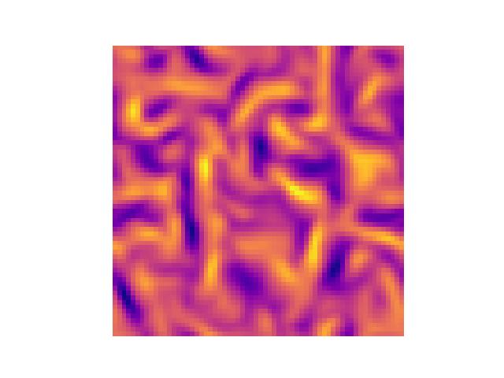

# Differentiable CFD Demo

This demo shows how to perform gradient-based optimization through a differentiable CFD simulator using Tesseract-JAX. We optimize the initial condition of [JAX-CFD](https://github.com/google/jax-cfd) setup running inside a Tesseract.

