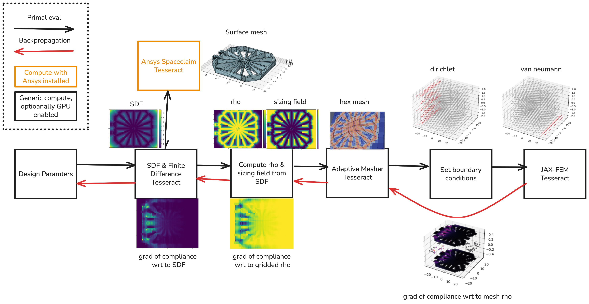

# ANSYS Tesseract Integration

This directory contains an example Tesseract configuration and scripts demonstrating how to use Tesseract-JAX with ANSYS spaceclaim and PyMAPDL. The overall worklflow is illustrated below:



## Get Started

### PL internal instructions:

- Our open ports are: 443, 8000 and 50052.
- Make sure to be connected to the PL VPN.

### Prerequisites

For the windows machine:
1. ANSYS installed and an active license.
2. Python and a python environment (e.g., conda, venv).
3. Two open ports.

For the linux machine:
1. Docker installed and running.
2. Python and a python environment (e.g., conda, venv).

### SpaceClaim Tesseract

Create a new python env. Assuming you using windows powerhsell, install the required dependencies:

```bash
pip install tesseract-core[runtime] trimesh
```

Clone this repository, navigate to the `examples/ansys/spaceclaim_tess` directory and start the Tesseract runtime server with:

```bash
tesseract-runtime serve --port <port_number_1> --host 0.0.0.0
```
Note that we dont build a Tesseract image for SpaceClaim in this example. This is because SpaceClaim cannot be installed in a containerized environment. You can test it using git bash and your specific Spaceclaim.exe Path:

```bash
curl -d '{"inputs":{"differentiable_parameters": [[200, 600, 0, 3.14, 0.39, 3.53, 0.79, 3.93, 1.18, 4.32, 1.57, 4.71, 1.96, 5.11, 2.36, 5.50, 2.75, 5.89], [400, 400, 0, 3.14, 0.39, 3.53, 0.79, 3.93, 1.18, 4.32, 1.57, 4.71, 1.96, 5.11, 2.36, 5.50, 2.75, 5.89]],  "non_differentiable_parameters": [800, 100], "string_parameters":["F:\\ANSYS Inc\\v242\\scdm\\SpaceClaim.exe", "geometry_generation.scscript"]}}' -H "Content-Type: application/json" http://0.0.0.0:443/apply
```


or the equivalent on powershell:

```powershell
Invoke-RestMethod -Uri "http://127.0.0.1:8000/apply" -Method Post -Body (
    @{
        inputs = @{
            differentiable_bar_parameters = [[0, 3.14], [0.39, 3.53], [0.79, 3.93], [1.18, 4.32], [1.57, 4.71], [1.96, 5.11], [2.36, 5.50], [2.75, 5.89]]
            differentiable_plane_parameters = [200, 600]
            non_differentiable_parameters = [800, 100]
            string_parameters = ["F:\\Ansys installations\\ANSYS Inc\\v241\\scdm\\SpaceClaim.exe", "geometry_generation.scscript"]
        }
    } | ConvertTo-Json -Depth 10
) -ContentType "application/json"
```

### PyMAPDL Server

On a windows machine, make sure ansys is installed. Then run the following powershell command to start ansys with grpc server enabled:

```powershell
Start-Process -FilePath "F:\ANSYS Inc\v242\ansys\bin\winx64\ANSYS242.exe" -ArgumentList "-grpc", "-port", "<port_number_2>"
```

replace "v242" with your ansys version.

### Build tesseracts

1. Obtain the ip adress of the windows machine by running:

```powershell
(Get-NetIPAddress -AddressFamily IPv4 -InterfaceAlias "Wi-Fi","Ethernet" | Where-Object {$_.IPAddress -notlike "169.254.*" -and $_.IPAddress -ne $null}).IPAddress
```
2. On the linux machine, create a new python env and install tesseract-core with:

```bash
pip install tesseract-core[runtime]
```

3. Build all relevant tesseracts:

```bash
tesseract build fem_tess
tesseract build pymapdl_tess
tesseract build meshing_tess
```
