# Grid Fin optimization with ANSYS SpaceClaim and PyANSYS

Eagle-eyed viewers of a SpaceX Super Heavy rocket launch may have noticed that during booster re-entry the speed at which the booster passes the ascent Maximum Dynamic Pressure altitude (Max-Q) is actually higher than ascent. This means that the always-deployed grid fins are experiencing their maximum loading during this critical stage of aerodynamic control guiding the booster back to the pad.

| Grid Fin Example | SpaceX Super Heavy Rocket    |
| ------------- | ------------- |
| 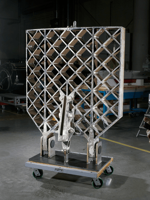 | 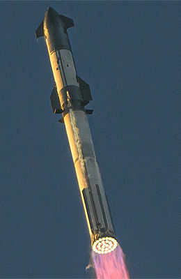 |

We are going to use software from the Ansys product collection along with Tesseracts to perform a parameter optimization on a SpaceX-style grid fin geometry. The goal is to maximize stiffness while maintaining a strict mass limit of 8 grid bars. This ensures the grid fin has a near constant freestream surface and remains rigid during re-entry Max-Q, keeping constant lift and drag characteristics, enabling robust and authoritative aerodynamic control. For this optimization the starting and ending positions of all the bar segments can be control by setting its angular positions. Hence for 8 segments this results in 16 free parameters. Below there are two images of two selected initial conditions:

| Grid initial conditions | Random initial conditions    |
| ------------- | ------------- |
| 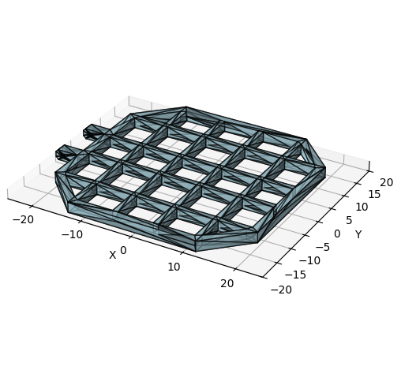 | 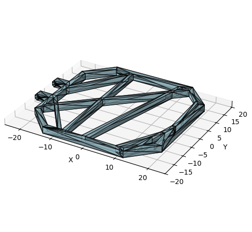 |

For the Boundary Conditions (BC) we fix the knuckles, as they would be attached to the rocket, by setting the corresponding mesh vertices to Dirichlet. Additionally we add an out of plane load at the very end of the fin geometry as a Von Neumann BC. Placing the load here allows us to approximate the aerodynamic forces experience by the whole grid fin whilst de-coupling the load from the bars movement. The boundary conditions are illustrated here:

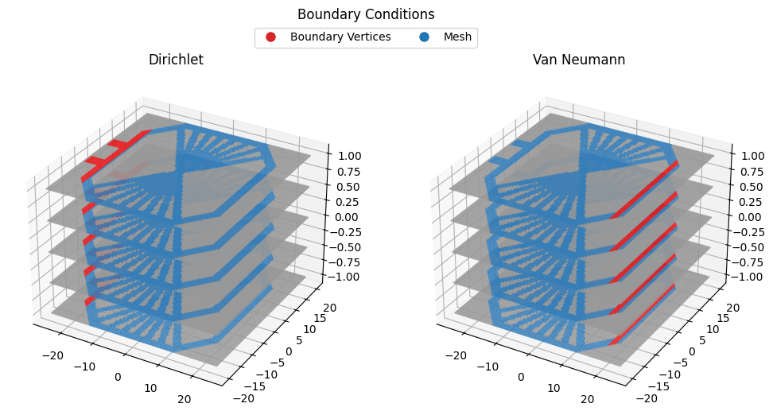

To simulate the grid fin under Max-Q loads, we employ a linear elastic solver, assuming small deformations and Hookean material behavior. Our optimization goal is to maximize stiffness, which is mathematically equivalent to minimizing Compliance.

## Workflow

To demonstrate a realistic engineering workflow, we perform a gradient based end to optimization that plugs into ANSYS SpaceClaim as a design software and uses PyANSYS to setup a differentiable finite element simulation. We containerize the individual components into Tesseracts and compose them together using Tesseract-JAX, a library that allows us to use the automatic differentiation (AD) capabilities of JAX in conjunction with Tesseracts. An illustration of the complete workflow is given below:

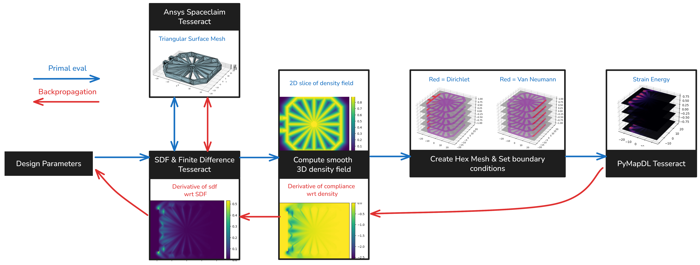

The workflow involves three Tesseracts:

- **Ansys SpaceClaim Tesseract** takes a set of differentiable and non differentiable parameters and injects them into a SpaceClaim script that generates the grid fin geometry. It then returns the resulting triangular surface mesh as a list of points and faces. More about this here: ...

- **SDF & Finite Difference Tesseract** takes the same set of geometry parameters, passes them to the SpaceClaim Tesseract (could be any other Tesseract that returns a polygon mesh) and computes the signed distance field for the geometry on a regular grid. Additionally, the Tesseract is differentiable and computes Jacobian of the SDF field with respect to the design space parameters using finite differences. It has some additional features, such as precomputing the Jacobian while the rest of the pipeline is busy with computing primals and vector Jacobian products (vjp) of later steps. In theory, we can plug any Tesseract that conforms to the in and output schema of the SpaceClaim Tesseract.

- **PyMAPDL Tesseract** takes a hex mesh, the boundary descriptions and computes the strain energy for all cells as well as the total compliance. It uses the PyMAPDL library to setup a fully differentiable FEM solver for linear elasticity. More about this here: ...

Aditionally there is python code that is responsible for setting the boundary conditions, constructing the hex mesh and deriving the density from an SDF. The functions responsible for setting the boundary conditions and mesh construction do not need to be differentiable. This is because we are differentiating with respect to the quantities that are carried on mesh cells. We are not differentiating with respect to the mesh structure or the boundary conditions. The functions that computes rho from SDF is similar to a sigmoid function and is made differentiable with JAXs AD.

## Optimization

As a very first experiment we compare the compliance of the two initial conditions. The grid arrangement, with a total compliance of 148 is clearly better than the random arrangement that achieves a compliance of 148. Below is a plot of the strain energy and the sensitivies of the compliance field with respect to the density field. A negative sensitivity indicates that the solver suggest adding material in the specified locations. We can observe a tendency to increase the thickness of the bars, indicicated by more negative values that are following the contours of the object. This, however is not possible under the parametrization of the objects.

For the optimization we have tried two optimizers, the classical Adam optimizer and Method of Moving Asymptotes (MMA) (Svanberg, 1987). We observed similar performance with the two optimzers, where both were very sensitive to the scale of the gradients and the learning rate.

| Adam | MMA    |
| ------------- | ------------- |
| 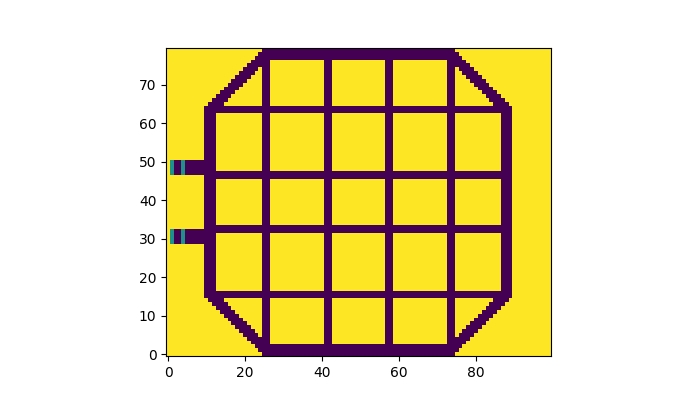 |  |
| 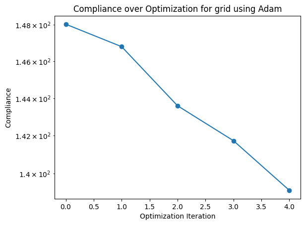 | 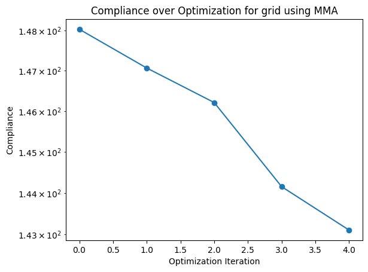 |

When applying the optimization on the random intitial conditions we can a steady decrease in the compliance, where the bars slowly arrange to a more optimal distribution.

| Loss | Surface Mesh    |
| ------------- | ------------- |
| 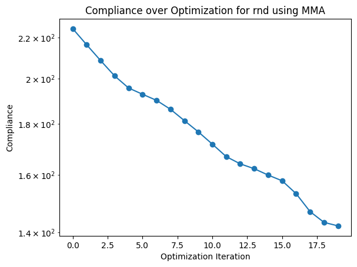 | 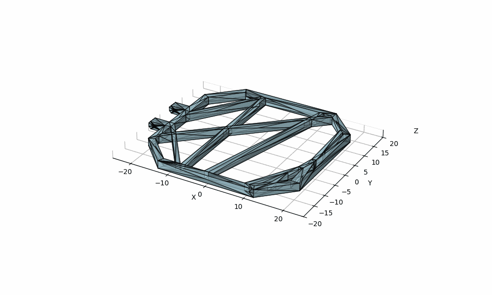 |

...

## Results

The optimization results show how a non-uniform grid pattern can provide a stiffer grid fin for the same mass. This stiffness is desirable as it will reduce deformation, keeping the lift and drag coefficients of the grid fin close to those assumed by the aerodynamic control laws.
